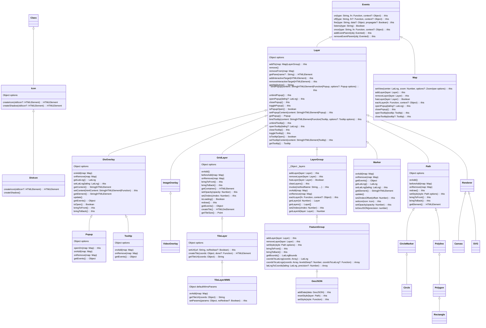

[leaflet.js](https://leafletjs.com/index.html) 是用于创建地图的开源 JavaScript 库。  
官方描述：

> Leaflet is the leading open-source JavaScript library for mobile-friendly interactive maps. Weighing just about 42 KB of JS, it has all the mapping features most developers ever need.

> Leaflet is designed with simplicity, performance and usability in mind. It works efficiently across all major desktop and mobile platforms, can be extended with lots of plugins, has a beautiful, easy to use and well-documented API and a simple, readable source code that is a joy to contribute to.

中文：

> Leaflet 是一个领先的开源 JavaScript 库，用于创建移动友好的交互式地图。它只有大约 42 KB 的 JavaScript 文件大小，却提供了大多数开发者所需的所有地图功能。

> Leaflet 的设计理念是简单性、性能和易用性。它在各种主要的桌面和移动平台上高效运行。

> Leaflet 的另一个优点是可扩展性。它提供了许多插件，可以轻松集成到地图中，增强其功能并添加额外的特性。
> Leaflet 还以其良好的文档化 API 而自豪，这使得开发者更容易理解和利用其功能。Leaflet 的源代码也以其简洁和可读性而闻名，这鼓励开发者做出贡献。

<!-- more -->

## 特性

国内主要有百度地图、高德地图、天地图等地图开发库，Leaflet.js 与其相比主要特点是轻量级和较高的扩展性。

在设计概念上，Leaflet.js 和其他地图库是相似的，都具有 图层、矢量图形、点标记等核心部件。  
不同的是，Leaflet.js 是一个纯前端的库， 没有提供服务接口，如果有相关需求需要对接高德地图等其他三方库的接口，这也是它轻量级的原因之一。

## 起步

首先使用 leaflet.js 创建一个简单的例子，了解一下这个库

1. 安装 leaflet 依赖

```bash
$ npm install --save-dev leaflet
```

2. 创建 index.html 文件

```html
<!DOCTYPE html>
<html>
  <head>
    <title>测试</title>
    <meta charset="UTF-8" />
    <style></style>
  </head>
  <body>
    <div id="map"></div>
  </body>
  <script type="module" src="./index.js"></script>
</html>
```

3. 创建 index.js 文件

```javascript
import {
  map,
  tileLayer,
  featureGroup,
  geoJSON,
  marker,
  divIcon,
  Point,
} from "leaflet";

function initMap() {
  return map("map", {
    zoom: 5,
    zoomDelta: 0.5,
    attributionControl: false,
    zoomControl: false,
    maxBoundsViscosity: 0.5,
    maxBounds: [
      [-80, 160],
      [80, -160],
    ],
  });
}

const mapInstance = initMap();
```

至此，地图就创建完了，但是这时地图没有配置图层，所以界面是白的。  
添加下面代码，使其展示地图图层

```javascript
import { tileLayer } from "leaflet";

const tileLayer = tileLayer(
  "http://webst04.is.autonavi.com/appmaptile?style=6&x={x}&y={y}&z={z}",
  {
    maxZoom: 18,
    minZoom: 1,
    zIndex: 1,
  }
);
mapInstance.addLayer(tileLayer);
```

## 进阶

只是简单了解 Leaflet.js，远不能实现项目中复杂的需求，我们还要多了解一下它的 API 和实现原理。

总而言之，地图类的库，最核心的就是 layer，即图层。  
图层这个概念使用范围很广，图像类的技术都有图层的概念，如图片就是多个图层纵向合并起来的画面；浏览器展示的页面，实际也是多个图层经过栅格化后呈现的画面。

在 Leaflet.js 中一切皆图层， Marker 是图层，矢量图形是图层，等等。

首先看一下 Leaflet.js 的核心类图：



使用 leaflet.js 编程，基本上是对上面的几个类进行操作，下面实现几个常用的需求：

### 设置地图瓦片

```javascript
import { tileLayer } from "leaflet";

const tiltUrl =
  "http://map.geoq.cn/ArcGIS/rest/services/ChinaOnlineStreetPurplishBlue/MapServer/tile/{z}/{y}/{x}";
const tileLayer = tileLayer(tiltUrl, {
  maxZoom: 18,
  minZoom: 1,
  zIndex: 1,
});
mapInstance.addLayer(tileLayer);
```

tiltUrl 是地图瓦片的网络地址，所以这块是很灵活的，可以随意的切换想用的地图。
以下是几种地图瓦片的网络地址：

- 高德 http://webst04.is.autonavi.com/appmaptile?style=6&x={x}&y={y}&z={z}

- http://map.geoq.cn/ArcGIS/rest/services/ChinaOnlineCommunity/MapServer/tile/{z}/{y}/{x}

- http://map.geoq.cn/ArcGIS/rest/services/ChinaOnlineStreetPurplishBlue/MapServer/tile/{z}/{y}/{x}

如 (图一)  
![(图一)]

### 在地图上画地区边界  

```javascript
import { geoJSON } from "leaflet";

const polygonLayer = geoJSON(polygonGeojson, {
  fill: false,
  zIndex: 2,
});
mapInstance.addLayer(polygonLayer);

```

其中 polygonGeojson 变量是一个 Polygon 或者 MultiPolygon 类型的 GeoJSON 数据。
数据可以在 [Data V](http://datav.aliyun.com/portal/school/atlas/area_selector) 获取。  
[GeoJSON](https://datatracker.ietf.org/doc/html/rfc7946#autoid-1) 是一种用于编码各种地理数据的格式，使用 JavaScript 对象表示（JSON）的结构。  

如 (图二)  
![(图二)]


### 创建 Marker

一般情况都会在地图上创建多个 Marker，我这里为了统一管理， 放到了一个 LayerGroup 里面。

```javascript
import {
  map,
  tileLayer,
  featureGroup,
  geoJSON,
  marker,
  divIcon,
  Point,
} from "leaflet";

const markerLayer = featureGroup([], {
  zIndex: 3,
});

let pointLayer;
let currentZoom;

const createMarker = function createMarker(geoJsonPoint, latlng) {
  const zoom = (mapInstance = getZoom());

  const properties = geoJsonPoint.geometry.properties;

  const icon = divIcon({
    html: `
        <div class="point" style="background: ${
          properties?.level?.color
        };display: ${zoom < 8 ? "block" : "none"};"></div>
        <div class="pointVal" style="background:  ${
          properties?.level?.color
        }; display:${zoom >= 8 ? "block" : "none"};">
          ${properties[this.activeFactor.property]}
        </div>
        `,
    className: "leaflet-div-icon",
  });

  const m = marker([latlng.lng, latlng.lat], {
    icon: icon,
    riseOnHover: true,
    geoJsonPoint,
  }).bindTooltip(properties?.cityName, {
    // 给 marker 绑定一个 tooltip，鼠标放上去的时候展示一些提示文字
    className: "leaflet-tooltip",
    sticky: true,
    offset: new Point(18, -8),
    direction: "top",
  });

  markerLayer.addLayer(m);
};

const handleZoomend = function ({ sourceTarget }) {
  const zoom = sourceTarget.getZoom();
  const isChange =
    (8 <= zoom && currentZoom <= 7) || (8 <= currentZoom && zoom <= 7);
  currentZoom = zoom;

  // 当地图 zoom 改变到界限值时， 重新创建 Marker，一般用于点的聚合和分裂
  if (isChange) {
    pointLayer = batchCreatePoint(geometryCollectionGeoJson);
  }
};

const batchCreatePoint = function (geometryCollectionGeoJson) {
  if (markerLayer && mapInstance.hasLayer(markerLayer)) {
    markerLayer.eachLayer((layer) => layer.off()).clearLayers();
  }
  return geoJSON(geometryCollectionGeoJson, {
    pointToLayer: createMarker,
  });
};

mapInstance.on("zoomend", this.handleZoomend);

pointLayer = batchCreatePoint(geometryCollectionGeoJson);
mapInstance.addLayer(pointLayer);
mapInstance.addLayer(markerLayer);
```

其中 geometryCollectionGeoJson 变量是一个 GeometryCollection 类型的 GeoJSON 数据。

如 (图三) 和（图四）
![(图三)]
![(图四)]

### 点击 Marker 打开对话框展示详情

```javascript
mapInstance.bindPopup( content: String|HTMLElement|Function|Popup , {
  minWidth: 400
});
```
如 (图五)
![(图五)]

[(图一)]: 1.jpg
[(图二)]: 2.jpg
[(图三)]: 3.jpg
[(图四)]: 4.PNG
[(图五)]: 5.jpg
